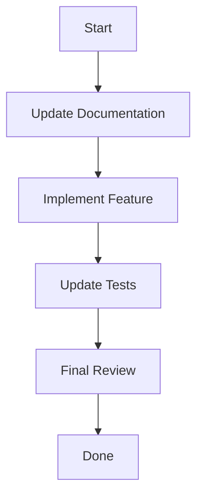

# Documentation Rules (MANDATORY)

## Update Docs Before Implementation

### When to Update Documentation
- Adding a new feature
- Adding a new component
- Adding a new hook
- Adding a new service
- Changing existing functionality
- Updating API endpoints

### Documentation Checklist
Before implementing any change, update:

1. **README.md** - If adding new features or changing tech stack
2. **docs/features.md** - For new features or feature changes
3. **docs/components.md** - For new components
4. **docs/hooks.md** - For new hooks
5. **docs/api.md** - For API changes
6. **AGENTS.md** - For new coding rules

### Implementation Flow


### Step-by-Step Process

#### Step 1: Update Documentation First
```bash
# Before implementing, update the relevant docs
# Example: Adding a new feature called "notifications"

# 1. Update docs/features.md
# Add new section with:
# - Feature description
# - Components list
# - Hooks list
# - Services list
# - Implementation status

# 2. Update README.md if needed
# Add to features list
```

#### Step 2: Implement the Feature
```typescript
// Now implement the feature
// features/notifications/index.tsx
export default function Notifications() {
  return <div>Notifications</div>
}
```

#### Step 3: Update Documentation Again
```bash
# Update docs with implementation details
# Mark items as completed in implementation status
```

### Documentation Templates

#### New Feature Template
```markdown
## Feature Name

**Location:** `src/features/feature-name/`

### Description
Brief description of the feature.

### Components
- `ComponentName` - Description

### Hooks
- `useHookName` - Description

### Services
- `serviceName.service.ts` - Description

### Types
- `feature.types.ts` - Description

### Implementation Status
- [ ] Component 1
- [ ] Component 2
- [ ] Hook 1
- [ ] Service 1
```

#### New Component Template
```markdown
### ComponentName
**File:** `component-name.tsx`

Description of the component.

```tsx
// Usage example
```

**Props:**
| Prop | Type | Default | Description |
|------|------|---------|-------------|
| prop1 | string | - | Description |
```

### Rules
- Documentation MUST be updated BEFORE implementation
- Never implement without updating docs first
- Keep documentation in sync with code
- Use consistent formatting across all docs
- Add version history for major changes
